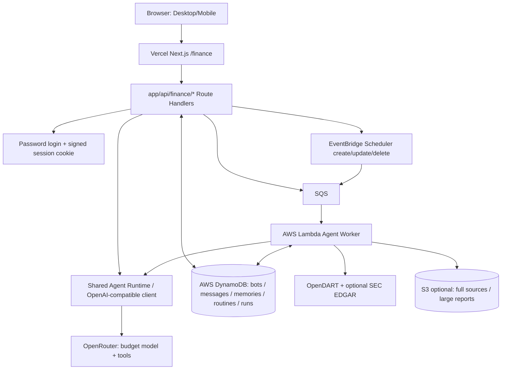

# 금융 특화 Multi-Agent PoC 구현 계획

> Status: proposal · Date: 2026-10-08 · Target: `jglee96/zakkdev` · Scope: 개인용, 실제 주문·매수·매도 없음

## 0. 현재 코드베이스와 제약

- 앱: Next.js 15 App Router, React 19, TypeScript, pnpm, Vercel 배포.
- UI: Mantine 8, Zustand. 기존 루트는 `app/`, `features/`, `entities/`, `views/`, `widgets/`, `shared/` 구조. `src/` 구조로 옮기지 않는다.
- 기존 AI: `app/ai/page.tsx`, `app/api/ai/ask/route.ts`, `features/blog-assistant/`. `openai@^6.8.1`을 활용한 Tool Calling Loop가 있고 현재는 블로그 글만 검색한다.
- 기존 AI와 블로그 동작은 유지한다. 금융 Agent의 경로·인증·데이터·시크릿은 분리한다.
- 사이트 `app/layout.tsx`에 전체 본문 `maxWidth: 768`이 설정돼 있다. 금융 앱이 좌측 Bot 목록/본문을 필요로 한다면 상위 레이아웃 분기 또는 route group을 검토한다. 초기에는 모바일 친화적인 단일 컬럼도 가능하다.
- 저장소는 public이므로 AWS/OpenRouter API 키, 식별 가능한 사용자 데이터, 실제 투자정보를 git에 저장하지 않는다.

## 1. 제품 목표 및 범위

사용자는 블로그의 `/finance`에서 Main Financial Bot과 대화하고, 자연어로 전문 Bot(국내 주식/해외 주식/지수 선물)을 **정의**하고, Bot별 목표/Tool/Memory를 유지하고, 자연어로 Routine을 생성해 정기 브리핑과 공시 분석을 실행한다. Bot은 별도의 영구 프로세스가 아니라 DB에 저장된 설정이며 실행 요청 시 공용 Runtime이 이를 읽는다.

### MVP 필수 시나리오
1. 인증된 소유자가 "국내 반도체 기업 공시 분석 봇 만들어 줘"라고 입력하면 Main Bot이 `create_bot` Tool을 통해 새 Bot을 등록하고 UI에 표시한다.
2. 동일 Bot과 다시 대화할 때 과거 분석/대화 맥락이 복원된다.
3. OpenDART에서 수집한 실제 공시의 접수번호/원문 링크/접수일자와 최초 관측 시점을 근거로 요약하고, 기존 가설과 새 증거를 비교한다. 정확한 발표 시각이 없는 자료는 날짜 정밀도로 표시한다.
4. "매일 오후 4시(한국시간)에 공시 확인"이라는 요청이 `create_routine`을 통해 영속 스케줄로 등록되고 사용자가 웹에서 나가도 AWS에서 실행된다.
5. 실행 상태/오류/보고서/출처/예상·실제 토큰 비용을 웹에서 확인할 수 있다.

### MVP 비범위
- 실제 주문/투자일임, 계좌 연동, 개인별 매수·매도 추천.
- 브라우저 Computer Use, VM/ECS/EKS, 자율 코드 실행, 무제한 범용 Tool.
- 실시간 지수 선물 시세 및 자동 거래(데이터 라이선스 검토 전).
- 뉴스 대량 수집/재배포, 정교한 모의투자 엔진, 벡터 DB, 멀티테넌트 관리 UI.

## 2. 아키텍처



- **대화 요청:** Next.js API Route에서 빠른 Main Bot 및 전문 Bot 응답. 짧은 작업만 동기 실행하며 timeout, 요청 횟수 및 토큰 제한을 적용한다. 큰 리서치는 `runId`를 반환하고 SQS에 enqueue.
- **예약/비동기 작업:** EventBridge Scheduler → SQS → Lambda → OpenRouter. Lambda 자체는 stateful하지 않다.
- **저장:** DynamoDB On-demand를 우선 사용. 개인 PoC는 조회 패턴 위주로 모델링하고, 임베딩 검색보다 ticker/companyId/날짜/가설 ID 기반 조회를 우선한다.
- **기술 경계:** Agent/Tool/Repository/LLM/Schedule Port는 클라우드 구현에 의존하지 않고 AWS SDK는 Adapter로 분리. 현재 앱을 모노레포로 전환하지 않는다.
- **클라우드 자격증명:** Vercel → AWS는 가능하면 OIDC 기반 임시 자격증명. 어려우면 최소 권한 IAM 자격증명을 회전하고 서버 환경변수에만 저장. Lambda에는 별도 IAM Role 사용.

## 3. 핵심 도메인·권한

### 주요 객체
| 객체 | 필수 필드 | 메모 |
|---|---|---|
| Bot | id, ownerId, parentBotId?, template, name, instructions, allowedTools, status | Main Bot은 특수한 템플릿. 사용자 Bot은 DB 정의이며 별도 VM 아님 |
| Message | id, ownerId, botId, role, content, createdAt | 최근 메시지 + 요약으로 컨텍스트 구성 |
| Memory / Thesis | id, ownerId, botId, subject/ticker, thesis, evidence[], status, updatedAt, sourceIds[] | 가설과 증거의 시점·출처 필수 |
| Routine | id, ownerId, botId, instruction, timezone, cronExpr, status, schedulerName, version | Routine Definition과 Cloud Scheduler 리소스 구분 |
| AgentRun | id, ownerId, botId, routineId?, routineVersion?, scheduledAt?, status, attempt, leaseOwner?, leaseExpiresAt?, fencingToken, model, usage, error, startedAt, finishedAt | 실행/비용/진행 추적, 멱등성 및 재획득 |
| Source | provider, sourceId, companyId, publishedDate, publishedAt?, timePrecision, firstSeenAt, fetchedAt, url, revision? | DART 접수번호 중복 방지; 없는 발표 시각은 추정하지 않음 |

### DynamoDB 초안
- 최소 `FinanceBots`, `FinanceMessages`, `FinanceMemories`, `FinanceRoutines`, `FinanceRuns` 테이블로 시작. 실제 조회 키에 맞춰 PK/SK 및 GSI를 설계하고 `Scan`은 사용하지 않는다.
- Bot 소유권 검사: `ownerId`와 `botId`의 결합키 조회 또는 ownerId 인덱스 사용. 클라이언트/LLM이 보낸 `ownerId`를 신뢰하지 않는다.
- Conversation/Insight는 Bot별로 분리하고 Main Bot은 명시적인 검색 Tool을 통해 다른 Bot 요약에 접근한다.
- 장문 공시 원문은 필요할 때만 S3에 저장하고 DB에는 식별자·링크·메타데이터를 기록한다.
- `AgentRuns`의 원시 실행 로그는 TTL 정리 가능. 핵심 투자 가설/출처/최종 보고서는 별도 보존 정책 사용.

### 개인용 비밀번호 인증 (MVP 확정)
- GitHub OAuth/계정 allowlist 대신 단일 소유자 비밀번호 로그인을 사용한다. 가입/비밀번호 복구/다중 사용자 기능은 MVP에 포함하지 않으며, OAuth는 다중 사용자 확장 시 검토한다.
- 비밀번호 원문은 저장하지 않는다. 로컬의 신뢰할 수 있는 도구로 Argon2id 해시를 생성하고 Vercel 서버 환경변수 `FINANCE_PASSWORD_HASH`에 저장한다. 암호학적으로 안전한 난수로 만든 최소 32바이트 세션 서명 키는 `FINANCE_SESSION_SECRET`에 별도 저장한다.
- 두 변수에 `NEXT_PUBLIC_` 접두사를 붙이지 않는다. Production/Preview별 값을 분리하며 공개 preview도 인증 없이 열지 않는다. 저장소에는 변수 이름/설명만 남기고 원문·해시·서명 키는 코드, Git, 클라이언트 번들, 로그, 채팅에 넣지 않는다. 로컬은 Git에서 제외되는 `.env.local`을 사용한다. 필수 설정이 없으면 인증/금융 API를 닫는다.
- 공개 `/finance/login` 화면에서 비밀번호를 HTTPS `POST /api/finance/auth/login` 본문으로 보낸다. 서버는 입력 크기 제한 → Origin 검증 → 공유 저장소 rate limit → Argon2id 검증 순서로 처리하며 비밀번호/쿠키/Authorization 원문을 로깅하지 않는다.
- 로그인 성공 시 검증된 서명 라이브러리로 서버가 고정한 단일 `ownerId`, 발급/만료 시각을 포함한 세션을 발급한다. 서명 알고리즘·issuer·audience를 고정하고 초기 만료는 8시간, 자동 연장은 하지 않는다. 요청 본문이나 LLM의 ownerId를 세션에 복사하지 않는다.
- 프로덕션 쿠키는 `__Host-finance-session`, `HttpOnly`, `Secure`, `SameSite=Strict`, `Path=/`, Domain 미설정, 세션 만료와 같은 Max-Age를 사용한다. 브라우저 localStorage에 토큰을 저장하지 않는다. HTTP localhost 개발만 별도 쿠키 이름/Secure 예외를 허용하고 배포 환경은 항상 HTTPS 설정을 사용한다.
- `/finance/login`과 로그인 API를 제외한 금융 화면은 서버에서 세션을 검증하고 미인증 시 로그인으로 보낸다. 보호된 모든 금융 Route Handler는 직접 서명·만료·ownerId를 검증해 미인증에 401을 반환한다. 화면 숨김/middleware만으로 API 보호를 대신하지 않는다. 인증/금융 응답은 `Cache-Control: no-store`로 공유 캐시를 막는다.
- 로그인·로그아웃 및 상태 변경 POST/PATCH/DELETE는 비밀이 아닌 서버 설정 `FINANCE_APP_ORIGIN`의 정확한 Origin과 비교하고 누락/불일치 요청을 거절한다. 임의의 요청 Host로 허용 Origin을 만들거나 `*.vercel.app` 전체를 허용하지 않는다. SameSite만으로 CSRF 검증을 대신하지 않는다.
- 로그인 시도 제한은 DynamoDB 조건부 갱신 등 인스턴스 간 공유되는 저장소로 구현한다. 신뢰할 수 있는 배포 플랫폼의 IP 정보 기준 한도와 전체 로그인 경로 한도를 함께 적용하고 실패 시 429/Retry-After를 반환한다. 초기 IP별 15분당 5회, 전체 15분당 30회로 시작하며 영구 계정 잠금은 하지 않는다. 저장소 장애 시 로그인은 거절하고 임의의 X-Forwarded-For를 신뢰하지 않는다.
- `POST /api/finance/auth/logout`은 같은 속성의 쿠키를 만료시킨다. Stateless 세션이므로 브라우저 쿠키 삭제가 탈취된 세션의 서버측 폐기를 의미하지는 않는다. 전체 세션 폐기는 `FINANCE_SESSION_SECRET` 회전으로 수행하며 비밀번호 변경 시 해시와 서명 키를 함께 회전한다.
- AWS 예약 Worker는 별도 IAM Role로 실행한다. 웹 비밀번호/쿠키를 SQS에 보내지 않으며 저장된 ownerId와 Bot/Routine 권한을 검증한다.

### Agent Tool 정책
- Main: `create_bot`, `list_bots`, `update_bot`, `create_routine`, `pause_routine`, `delete_routine`, `invoke_bot`, `list_reports`.
- KR Stock: `search_dart_filings`, `get_financials`, `find_relevant_theses`, `save_insight`.
- US Stock: `search_sec_filings` (후속), `find_relevant_theses`, `save_insight`.
- Index Futures: 초기에는 데이터가 준비되지 않은 템플릿/샘플 데이터. 실거래/실시간 시세/레버리지 추천 제외.
- Tool은 **스키마 검증(Zod 등) → 인증/소유권 → 허용 정책 → rate/budget → 실행** 순서로 처리. LLM에게 SDK 임의 실행, DB 관리 권한, 쉘 실행권한을 주지 않는다.
- 비용 발생/권한 변경 작업은 사용자 확인 UI 또는 명시적인 한도를 우선 적용한다.

## 4. API 계약 초안

| HTTP API | 기능 | 실행 |
|---|---|---|
| `POST /api/finance/auth/login` | 비밀번호 검증·세션 쿠키 발급; 인증 전 Origin/rate limit 적용 | Vercel Node.js Route |
| `POST /api/finance/auth/logout` | 세션 검증·쿠키 만료 | Vercel Node.js Route |
| `POST /api/finance/chat` | 대화, Main Bot 도구 호출, 짧은 요청의 응답 | Vercel Node.js Route |
| `GET/POST /api/finance/bots` | 소유 Bot 조회/생성 | Vercel |
| `GET/PATCH /api/finance/bots/[botId]` | 설정·상태 확인/수정 | Vercel |
| `GET /api/finance/bots/[botId]/messages` | Bot 대화 목록 | Vercel |
| `GET/POST /api/finance/routines` | Routine 생성/조회 | Vercel |
| `PATCH/DELETE /api/finance/routines/[routineId]` | 변경/일시정지/삭제 | Vercel |
| `POST /api/finance/runs` | 명시적 백그라운드 실행 enqueue | Vercel |
| `GET /api/finance/runs/[runId]` | 완료 상태/오류/토큰 비용 조회 | Vercel |
| `GET /api/finance/reports` | 결과 및 원문 출처 목록 | Vercel |

`/api/ai/ask`와 기존 블로그 AI 기능은 변경하지 않는다. 별도 클라이언트 UI를 `/finance`, `/finance/bots/[botId]`에 배치한다. 첫 단계는 polling으로 실행 상태 조회; SSE는 이후 필요 시.

## 5. Routine 생성과 실행 일관성

### 등록·변경 및 대기 이벤트
1. Authenticated Main Agent가 Tool arguments(예: `daily 16:00 Asia/Seoul`)를 구조화한다. Cron 입력을 신뢰하지 않고 Backend가 제한·검증·변환한다. MVP는 `FlexibleTimeWindow: OFF`.
2. `Routine`을 `pending`으로 저장하고 안정적인 Scheduler name과 요청별 ClientToken으로 CreateSchedule API를 호출한다. 성공 시 ARN 및 `active` 저장. 응답 유실/DB 갱신 실패도 고려해 **P3에 reconciliation 작업을 포함**하고 동일 요청 재시도로 스케줄이 중복 생성되지 않게 한다.
3. Scheduler target Input은 `routineId`, `routineVersion`, `scheduledAt`을 포함한다. `scheduledAt`은 `<aws.scheduler.scheduled-time>`으로 채우고 UTC로 정규화한다. Worker 수신 시각이나 재시도마다 달라질 수 있는 execution ID를 멱등성 키로 쓰지 않는다.
4. Worker는 DB에서 Instruction/권한을 다시 읽고 Routine/Bot의 존재·active 상태, 소유권 및 `routineVersion` 일치를 확인한다. 중지·삭제·버전 변경 이전의 대기 이벤트는 비용 발생 없이 건너뛰고 이유를 기록한다. 수동 실행에도 인증 컨텍스트에서 ownerId를 유도하고 요청 idempotency key를 사용한다.
5. 수정·중지는 DB version 조건부 갱신을 먼저 수행해 기존 이벤트를 무효화한 뒤 Scheduler를 변경한다. 삭제는 일단 tombstone으로 보존하고 Scheduler 삭제를 재시도한다. 중간 상태는 실행 불가로 처리하며 reconciliation으로 수렴시킨다.
6. 중지는 새 작업과 다음 외부 호출을 막는다. 이미 전송한 LLM 요청의 취소/환불은 보장하지 않는다. 재개는 새 version을 발급하고 과거 누락분을 자동 재생하지 않는다. 실행 및 결과 저장 직전에도 상태/version을 검증한다.
7. Scheduler는 정확히 정각 완료를 보장하지 않으며, SQS/Worker가 중복 실행/지연될 수 있음을 UX와 구현에 반영한다. "신규 공시 발생 시"는 MVP에서 정기 폴링으로 대체한다.

### 실행 lease 및 결과 저장
- 예약 실행의 안정적인 키는 `routineId + routineVersion + scheduledAt`; 최초 조건부 생성 후 `queued → running → completed | failed | canceled`. 재시도 가능한 실패는 `queued`로 돌리고 attempt/nextAttemptAt을 기록한다.
- 실행 획득 시 lease owner/만료 시각과 단조 증가 fencing token을 조건부 갱신한다. 유효 lease를 다른 Worker가 보유한 경우 메시지를 성공 처리하지 않고 재전달되도록 한다. 완료/취소 또는 재시도 불가로 확정된 실패만 중복 전달을 성공 처리한다.
- 비정상 종료 후 lease가 만료되면 기존 run을 재획득한다. 장시간 작업은 lease를 갱신하며, 이전 Worker의 늦은 쓰기는 fencing token 검사로 거절한다. 외부 LLM 호출 자체의 exactly-once는 보장하지 않는다.
- 보고서는 runId로 유일하게 저장한다. 최종 보고서 확정, 가설/증거 변경, 완료 상태는 lease 및 Routine version 조건을 포함하는 DynamoDB transaction으로 커밋한다. S3를 쓰는 경우 먼저 불변 아티팩트를 저장하고 DB에서 참조를 확정한다. 고아 아티팩트는 정리한다.
- Tool mutation도 `runId + stepId + toolCallId`로 실행 결과를 기록하고 재시도 시 재사용한다. 가설은 version 조건으로 갱신하여 서로 다른 run의 갱신 유실을 방지한다. 트랜잭션 한도를 넘는 결과는 작은 메타데이터/불변 증거 참조로 나눈다.

### SQS/Lambda 재시도 계약
- 초기 Worker는 batch size 1, batch window 0, Lambda timeout 180초, 실행 deadline 120초, SQS visibility timeout 최소 1080초(함수 timeout의 6배)로 시작한다. 측정 후 함께 조정한다.
- Event source mapping에 `ReportBatchItemFailures`를 활성화한다. 재시도 가능한 오류/lease 충돌은 실패한 messageId를 반환하거나 invocation을 실패시킨다. catch 후 정상 반환하여 메시지를 유실시키지 않는다.
- 처리 큐는 maxReceiveCount 5의 redrive policy와 Worker DLQ를 사용한다. Scheduler→SQS 전달 실패용 DLQ는 별도로 구성한다. 영구 입력 오류는 failed 상태 및 오류 기록 후 ack; 전달/일시 장애와 구분한다.
- maxReceiveCount 초과 후 DLQ로 이동한 run은 reconciliation에서 실패/복구 필요 상태로 정리한다. 운영자가 redrive할 때 같은 run key/checkpoint를 사용하고 중복 보고서가 없음을 검증한다.

## 6. 금융 데이터·분석 품질

- **수집/검증 단계는 결정론적으로:** OpenDART `corp_code`, `rcept_no`, `rcept_dt`(접수일자)를 보존하고 재무 계산은 코드에서 수행. 공시검색 API의 `rcept_dt`는 `YYYYMMDD`이며 정확한 발표 시각이 아니다.
- **LLM은 해석과 추가 조사 담당:** 공시/매출·이익률 변화와 기존 Thesis를 비교하고 `support / contradict / neutral` 근거를 구조화.
- **모든 인사이트에 인용 링크, 접수일자, 최초 관측 시각, 분석 시각, 데이터 기준 시점 기록.** 정확한 발표 시각은 검증 가능한 공급원이 있을 때만 `publishedAt`에 저장하고 `timePrecision: date | datetime`을 표시한다. 출처가 없으면 '확인할 수 없음'으로 응답.
- 변경 공시의 원문 정정 이력과 회고 시점의 정보 가용성(point-in-time)을 고려. 최초 관측 시각은 실제 발표 시각과 구별한다. MVP의 장중 회고는 해당 시점 이전에 실제 관측·보존한 자료만 사용하며, 나중에 수집한 과거 공시는 당일 특정 시각에 알려졌다고 단정하지 않는다. 정정 전 자료를 최신 값으로 덮어쓰지 않는다.
- 초기에는 한국 주식 공시 한정. 미국 공시/뉴스/지수 선물은 기능 완성 후 순차 확장.

## 7. OpenRouter·비용·안전

- 기존 `openai` 패키지의 `baseURL: https://openrouter.ai/api/v1`로 별도 Provider를 구성. `OPENROUTER_API_KEY`, `FINANCE_MODEL`, `FINANCE_FALLBACK_MODEL`을 서버 환경변수에만 저장.
- 선택 모델/제공자가 **tool calling / structured output**을 지원하는지 smoke test. 저가 모델에서 도구 인수 정확도가 부족하면 핵심 mutation Tool만 상위 모델 또는 확인 단계 사용.
- 사용자별/일별 요청 한도, Bot 수, Routine 수, Agent Run당 step 수(초기 6), 도구 호출 수, input/output token 및 비용 상한을 정의. 실제 USD 한도는 서버 설정에 명시하고 누락/잘못된 설정은 실행 거절한다.
- **예산은 호출 전에 원자적으로 예약:** DynamoDB 조건부 갱신/transaction으로 `spent + reserved + requested ≤ limit`을 보장한다. 대화/예약/재시도가 동일한 owner 일별 예산을 공유한다. `invoke_bot`은 부모 run의 잔여 step·시간·비용 예산을 공유하고 재귀 깊이를 제한한다.
- 고정 allowlist 모델/제공자와 검증된 가격 상한, 전체 입력 토큰 및 최대 출력 토큰으로 다음 호출의 최대 비용을 예약한다. 가격/토큰 상한을 계산할 수 없는 모델·fallback은 거절한다. 성공 시 usage로 정산하며 모델 전환/재시도도 새 예약이 필요하다.
- timeout/응답 유실로 과금 여부가 불명확하면 예약을 즉시 반환하지 않는다. usage 조회·reconciliation으로 정산하고 해결 전에는 보수적으로 예산에 포함한다. 로컬 한도는 공급자 청구와 완전히 동일한 실시간 차단을 보장하지 않으므로 전용 OpenRouter 키의 credit limit도 함께 설정한다.
- 성공/실패/모델/토큰/도구 호출/시간을 AgentRun에 기록하고 월간 AWS Budgets + OpenRouter 잔액/사용량 확인. AWS Budgets는 감시/알림이며 run 예산 예약을 대체하지 않는다.
- **명시적 timeout:** OpenAI SDK의 기본 timeout 10분/재시도 2회를 그대로 쓰지 않는다. 금융 Provider는 `maxRetries: 0`; Runtime이 일시 장애에 한해 최대 1회 재시도하며 예산과 deadline을 다시 확인한다.
- 동기 대화는 Route maxDuration 60초를 배포 플랜에서 확인하고 전체 deadline 50초, LLM 호출 timeout 최대 20초(남은 시간 이내), AbortSignal을 사용한다. 플랜 한도가 더 짧으면 deadline을 낮춘다. Worker는 전체 120초, LLM 호출 최대 40초로 시작한다.
- 큰 리서치는 실행 시작 전에 durable run을 저장하고 SQS로 넘겨 `202 + runId`를 반환한다. enqueue 실패는 run 상태로 기록하고 재전송한다. 동기 deadline을 넘기면 작업을 중단하고 checkpoint/상태를 기록한다. 진행 중 실행을 새 run으로 몰래 재시작하지 않으며, 재개는 같은 run/checkpoint와 명시적인 재시도 경로를 사용한다.
- 공개 블로그에서 `/finance`는 비밀번호 로그인·서명 세션으로 보호하며 로그인 API를 제외한 금융 API는 서버측 인증을 강제한다. Origin 검사와 공유 로그인 rate limit은 로그인 API에도 적용한다. CloudWatch 등 로그에는 비밀번호/해시/세션 키/쿠키/API Key/금융 개인 데이터 노출 금지.
- 외부 뉴스·공시 텍스트는 **untrusted tool output**으로 취급하여 Prompt Injection이 Bot 생성·Routine 수정 등 privileged tool 실행으로 이어지지 않도록 분리.
- 금융상품 매수/매도 지시, 실제 계좌 조작, 개인 맞춤 투자자문은 MVP에서 제외.

## 8. 코드 배치안 (현행 루트 구조 유지)

```text
app/
  finance/page.tsx
  finance/bots/[botId]/page.tsx
  api/finance/chat/route.ts
  api/finance/bots/route.ts
  api/finance/routines/route.ts
  api/finance/runs/[runId]/route.ts
features/
  finance-agent/{ui,model,api}/
entities/
  finance-bot/
  finance-insight/
shared/
  finance/{agent-runtime,tools,model-provider,repositories,schedule-provider}/
workers/
  finance-agent/handler.ts
infra/
  cdk/
docs/
  finance-agent-poc-plan.md
```

- Shared runtime에 `LLMProvider`, `BotRepository`, `MemoryRepository`, `ScheduleProvider` 인터페이스를 둔다.
- OpenRouter, DynamoDB, EventBridge, SQS는 Adapter에서 구현. Vercel Route와 Lambda Worker 모두 Core를 import하도록 빌드 경계를 유지한다.
- 배포는 기존 Vercel 설정 유지, Lambda/CDK 별도 배포. Worker 아티팩트가 Next.js 번들에 섞이지 않도록 테스트.

## 9. 구현 단계, 완료 조건, 우선순위

### P0 — 접근 통제·기반 (필수)
- [ ] `/finance/login`, 비밀번호 로그인/로그아웃 API, 서명 세션 쿠키 및 금융 화면/API 서버측 인증 구현. 기존 공개 `/ai`는 유지.
- [ ] Argon2id 해시/세션 키의 서버 환경변수 등록·회전 문서, Origin 검사, 분산 로그인 시도 제한 및 설정 누락 시 접근 차단.
- [ ] AWS CDK 기반 최소 인프라(DynamoDB/예산 저장소, IAM, SQS/Worker DLQ, Scheduler 전달 DLQ, Lambda 및 Scheduler 역할)와 배포/회수 문서 구성. Worker 리소스는 P0에서 준비하고 실제 예약 실행 연결은 P3에서 수행.
- [ ] 비용 한도, API Key/환경변수, 로컬 실행/배포 문서.
- **DoD:** 미인증 사용자는 로그인 API 외 금융 API에 접근할 수 없고 기존 블로그 빌드/AI 페이지가 정상. 정상/오류 비밀번호, 위조/만료 세션, 로그아웃, 키 회전, Origin 거절, 여러 서버 인스턴스의 로그인 제한을 검증. 인프라 deploy/synth 및 권한 거절 검증, 동시 요청 예산 초과 차단을 확인. 구현 책임은 이슈 #44.

### P1 — Main Bot·전문 Bot·대화 (필수)
- [ ] OpenRouter Provider와 모델별 Tool Calling/JSON schema smoke test.
- [ ] Bot Definition CRUD 및 사용자 권한 검사; Main Bot이 `create_bot` Tool로 KR/US/Futures Bot 생성.
- [ ] 공용 실행 루프(step/input/output/예산/deadline 상한·Tool Registry), Message 영속화 및 대화 복원. SDK 자동 재시도 비활성화 및 자식 Bot의 부모 예산 공유.
- **DoD:** 서버 재시작 후에도 Bot 2개 이상과 각 대화가 분리되어 유지. timeout/재시도/중첩 invoke_bot에서도 실행·비용 한도를 초과하지 않고 상태가 기록됨.

### P2 — 금융 데이터·Research Memory (필수)
- [ ] OpenDART 통합(실제 공시 ID/원문 링크/접수일자/firstSeenAt/timePrecision), 단위 테스트용 fixture. 날짜 자료에 임의의 발표 시각을 넣지 않음.
- [ ] `Insight / Thesis / Evidence / Source` 모델, 공시 중복 제거, 이전 가설 검색·업데이트.
- [ ] 보고서 출처·수치 검증 및 hallucination 회귀 테스트.
- **DoD:** 같은 기업의 두 시점 공시를 비교해 이전 가설의 지지/반증 근거와 원문 URL을 제시. 날짜 정밀도/정정 이력을 표시하고 미래 또는 미관측 자료를 과거 장중 분석에 사용하지 않음.

### P3 — Routine·AWS 백그라운드 실행 (필수)
- [ ] Main Bot `create_routine` Tool, 시간대 검증/수정/일시정지/삭제.
- [ ] EventBridge Scheduler → SQS/DLQ → Lambda → DynamoDB의 비동기 파이프라인.
- [ ] version/상태 검증, lease/fencing 재획득, 결과 transaction, 부분 배치 실패, DLQ redrive, DB·Scheduler·run reconciliation 및 실패 경보.
- **DoD:** Vercel/로컬 브라우저 종료 상태에서 지정한 시각에 Bot이 실행되고 보고서가 저장됨. 생성 직후/저장 직전 Worker 강제 종료 후 재처리에서 작업 유실·중복 보고서 없음. 중지/삭제/수정 이전 대기 이벤트는 실행되지 않고, DLQ redrive와 Scheduler 불일치 복구가 재현됨.

### P4 — UI·E2E 검증 (필수)
- [ ] Mantine 기반 `/finance` Main Bot/사이드 Bot 목록/대화/보고서/스케줄 관리.
- [ ] 반응형 레이아웃, 실행 중·실패·재시도 상태, 출처 링크/비용 표기.
- [ ] 사용자 여정 E2E: Bot 생성 → 공시 분석 → Memory 복구 → Routine 생성 → 예약 보고서 확인. 중지/수정, 예산 초과, timeout/실패 후 재시도 UX도 포함.
- **DoD:** 데스크톱·모바일에서 전체 시나리오가 재현되고 기존 블로그에 회귀 없음.

### P5 — 후속(선택)
- [ ] 미국 SEC EDGAR, 사용자별 Watchlist, 이벤트 기반 공시 알림.
- [ ] 뉴스 유료 공급자/라이선스 확인 후 브리핑, 선물 시세 공급자 연동.
- [ ] Paper Portfolio와 전략 회고, 필요시 Semantic Search/pgvector 또는 OpenSearch.

## 10. 테스트·운영 기준

- Unit: Cron/Timezone DST 처리, Tool schema, ownership, finance calculations, 중복/정정 공시, 날짜 정밀도/point-in-time, input/output/step 상한, timeout 및 자식 Bot 예산 공유.
- Integration (mocked AWS/OpenRouter + disposable AWS 환경 검증): Bot 생성→저장, 원자적 동시 예산 예약/불명확 과금, Routine 등록 응답 유실, 중지/삭제/수정 후 대기 메시지, lease 만료/늦은 Worker 쓰기, 결과 커밋 전후 강제 종료, SQS 재전달/부분 배치 실패, DLQ redrive/reconciliation, permission denial. Mock 통과만으로 실제 AWS 전달 계약 검증을 대신하지 않음.
- E2E: 기존 사이트 `/ai` 회귀 + 비밀번호 로그인/로그아웃 및 `/finance` Bot/Routine 여정. API 직접 호출·위조/만료 쿠키·Origin 누락/불일치·동시 로그인 제한·환경변수 누락·키 회전도 검증하고 응답/클라이언트 번들/로그에 시크릿이 없는지 확인.
- 로그: `requestId`, `runId`, `botId`, duration, 모델, token usage, 비용 추정, tool execution outcome(민감한 입력/출력 원문 저장 최소화).
- 배포/롤백: `/finance` feature flag, IAM least privilege, CDK destroy 범위와 DynamoDB data retention 정책 분리.
- 의사결정 게이트: P1 완료 후 OpenRouter 모델 품질/비용 확인 → P2 진행; P2 데이터 정확도 확인 → P3 예약 실행 연결.

## 11. 확인해야 할 설계 결정

1. **확정:** 개인용 MVP는 Argon2id 비밀번호 검증 + 만료되는 서명 세션 쿠키. 서버 환경변수로 해시/세션 키를 관리하며 GitHub OAuth는 후속 다중 사용자 확장 시 검토.
2. OpenRouter 기본/예비 모델: 가격보다 **Tool Calling과 근거 있는 금융 분석 품질**을 먼저 smoke test해서 결정.
3. 지수 선물: MVP에서는 Bot 템플릿만 제공하고 실시간 데이터 도구는 비활성화.
4. 블로그 레이아웃 `maxWidth: 768`을 금융 화면에서 우회할지(초기 단일 컬럼 vs 금융 전용 Layout).
5. 스케줄 실행 완료 알림은 초기 화면/보고서 조회, 이후 이메일·Push로 확장.

## 12. 구현 시 참조할 공식 계약

- [Scheduler context attributes](https://docs.aws.amazon.com/scheduler/latest/UserGuide/managing-schedule-context-attributes.html): scheduled-time과 invocation attempt 식별자 구별.
- [Lambda SQS 오류 처리](https://docs.aws.amazon.com/lambda/latest/dg/services-sqs-errorhandling.html): 부분 배치 실패와 재시도.
- [Lambda SQS event source 구성](https://docs.aws.amazon.com/lambda/latest/dg/services-sqs-configure.html): visibility timeout과 함수 timeout 관계.
- [OpenDART 공시검색 API](https://opendart.fss.or.kr/guide/detail.do?apiGrpCd=DS001&apiId=2019001): `rcept_dt`는 접수일자(YYYYMMDD).

---
본 문서는 구현 계획만 제시하며 실제 코드/인프라 배포를 수행하지 않는다.
