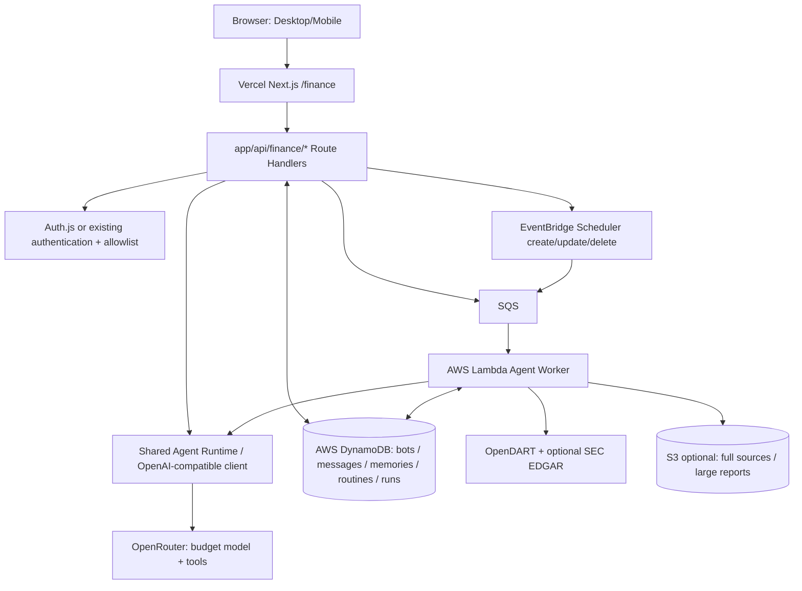

# 금융 특화 Multi-Agent PoC 구현 계획

> Status: proposal · Date: 2026-10-08 · Target: `jglee96/zakkdev` · Scope: 개인용, 실제 주문·매수·매도 없음

## 0. 현재 코드베이스와 제약

- 앱: Next.js 15 App Router, React 19, TypeScript, pnpm, Vercel 배포.
- UI: Mantine 8, Zustand. 기존 루트는 `app/`, `features/`, `entities/`, `views/`, `widgets/`, `shared/` 구조. `src/` 구조로 옮기지 않는다.
- 기존 AI: `app/ai/page.tsx`, `app/api/ai/ask/route.ts`, `features/blog-assistant/`. `openai@^6.8.1`을 활용한 Tool Calling Loop가 있고 현재는 블로그 글만 검색한다.
- 기존 AI와 블로그 동작은 유지한다. 금융 Agent의 경로·인증·데이터·시크릿은 분리한다.
- 사이트 `app/layout.tsx`에 전체 본문 `maxWidth: 768`이 설정돼 있다. 금융 앱이 좌측 Bot 목록/본문을 필요로 한다면 상위 레이아웃 분기 또는 route group을 검토한다. 초기에는 모바일 친화적인 단일 컬럼도 가능하다.
- 저장소는 public이므로 AWS/OpenRouter API 키, 식별 가능한 사용자 데이터, 실제 투자정보를 git에 저장하지 않는다.

## 1. 제품 목표 및 범위

사용자는 블로그의 `/finance`에서 Main Financial Bot과 대화하고, 자연어로 전문 Bot(국내 주식/해외 주식/지수 선물)을 **정의**하고, Bot별 목표/Tool/Memory를 유지하고, 자연어로 Routine을 생성해 정기 브리핑과 공시 분석을 실행한다. Bot은 별도의 영구 프로세스가 아니라 DB에 저장된 설정이며 실행 요청 시 공용 Runtime이 이를 읽는다.

### MVP 필수 시나리오
1. 인증된 소유자가 "국내 반도체 기업 공시 분석 봇 만들어 줘"라고 입력하면 Main Bot이 `create_bot` Tool을 통해 새 Bot을 등록하고 UI에 표시한다.
2. 동일 Bot과 다시 대화할 때 과거 분석/대화 맥락이 복원된다.
3. OpenDART에서 수집한 실제 공시의 접수번호/원문 링크/발표 시점을 근거로 요약하고, 기존 가설과 새 증거를 비교한다.
4. "매일 오후 4시(한국시간)에 공시 확인"이라는 요청이 `create_routine`을 통해 영속 스케줄로 등록되고 사용자가 웹에서 나가도 AWS에서 실행된다.
5. 실행 상태/오류/보고서/출처/예상·실제 토큰 비용을 웹에서 확인할 수 있다.

### MVP 비범위
- 실제 주문/투자일임, 계좌 연동, 개인별 매수·매도 추천.
- 브라우저 Computer Use, VM/ECS/EKS, 자율 코드 실행, 무제한 범용 Tool.
- 실시간 지수 선물 시세 및 자동 거래(데이터 라이선스 검토 전).
- 뉴스 대량 수집/재배포, 정교한 모의투자 엔진, 벡터 DB, 멀티테넌트 관리 UI.

## 2. 아키텍처



- **대화 요청:** Next.js API Route에서 빠른 Main Bot 및 전문 Bot 응답. 짧은 작업만 동기 실행하며 timeout, 요청 횟수 및 토큰 제한을 적용한다. 큰 리서치는 `runId`를 반환하고 SQS에 enqueue.
- **예약/비동기 작업:** EventBridge Scheduler → SQS → Lambda → OpenRouter. Lambda 자체는 stateful하지 않다.
- **저장:** DynamoDB On-demand를 우선 사용. 개인 PoC는 조회 패턴 위주로 모델링하고, 임베딩 검색보다 ticker/companyId/날짜/가설 ID 기반 조회를 우선한다.
- **기술 경계:** Agent/Tool/Repository/LLM/Schedule Port는 클라우드 구현에 의존하지 않고 AWS SDK는 Adapter로 분리. 현재 앱을 모노레포로 전환하지 않는다.
- **클라우드 자격증명:** Vercel → AWS는 가능하면 OIDC 기반 임시 자격증명. 어려우면 최소 권한 IAM 자격증명을 회전하고 서버 환경변수에만 저장. Lambda에는 별도 IAM Role 사용.

## 3. 핵심 도메인·권한

### 주요 객체
| 객체 | 필수 필드 | 메모 |
|---|---|---|
| Bot | id, ownerId, parentBotId?, template, name, instructions, allowedTools, status | Main Bot은 특수한 템플릿. 사용자 Bot은 DB 정의이며 별도 VM 아님 |
| Message | id, ownerId, botId, role, content, createdAt | 최근 메시지 + 요약으로 컨텍스트 구성 |
| Memory / Thesis | id, ownerId, botId, subject/ticker, thesis, evidence[], status, updatedAt, sourceIds[] | 가설과 증거의 시점·출처 필수 |
| Routine | id, ownerId, botId, instruction, timezone, cronExpr, status, schedulerName, version | Routine Definition과 Cloud Scheduler 리소스 구분 |
| AgentRun | id, ownerId, botId, routineId?, scheduledAt?, status, model, usage, error, startedAt, finishedAt | 실행/비용/진행 추적, 멱등성 |
| Source | provider, sourceId, companyId, publishedAt, fetchedAt, url, revision? | DART 접수번호 중복 방지 |

### DynamoDB 초안
- 최소 `FinanceBots`, `FinanceMessages`, `FinanceMemories`, `FinanceRoutines`, `FinanceRuns` 테이블로 시작. 실제 조회 키에 맞춰 PK/SK 및 GSI를 설계하고 `Scan`은 사용하지 않는다.
- Bot 소유권 검사: `ownerId`와 `botId`의 결합키 조회 또는 ownerId 인덱스 사용. 클라이언트/LLM이 보낸 `ownerId`를 신뢰하지 않는다.
- Conversation/Insight는 Bot별로 분리하고 Main Bot은 명시적인 검색 Tool을 통해 다른 Bot 요약에 접근한다.
- 장문 공시 원문은 필요할 때만 S3에 저장하고 DB에는 식별자·링크·메타데이터를 기록한다.
- `AgentRuns`의 원시 실행 로그는 TTL 정리 가능. 핵심 투자 가설/출처/최종 보고서는 별도 보존 정책 사용.

### Agent Tool 정책
- Main: `create_bot`, `list_bots`, `update_bot`, `create_routine`, `pause_routine`, `delete_routine`, `invoke_bot`, `list_reports`.
- KR Stock: `search_dart_filings`, `get_financials`, `find_relevant_theses`, `save_insight`.
- US Stock: `search_sec_filings` (후속), `find_relevant_theses`, `save_insight`.
- Index Futures: 초기에는 데이터가 준비되지 않은 템플릿/샘플 데이터. 실거래/실시간 시세/레버리지 추천 제외.
- Tool은 **스키마 검증(Zod 등) → 인증/소유권 → 허용 정책 → rate/budget → 실행** 순서로 처리. LLM에게 SDK 임의 실행, DB 관리 권한, 쉘 실행권한을 주지 않는다.
- 비용 발생/권한 변경 작업은 사용자 확인 UI 또는 명시적인 한도를 우선 적용한다.

## 4. API 계약 초안

| HTTP API | 기능 | 실행 |
|---|---|---|
| `POST /api/finance/chat` | 대화, Main Bot 도구 호출, 짧은 요청의 응답 | Vercel Node.js Route |
| `GET/POST /api/finance/bots` | 소유 Bot 조회/생성 | Vercel |
| `GET/PATCH /api/finance/bots/[botId]` | 설정·상태 확인/수정 | Vercel |
| `GET /api/finance/bots/[botId]/messages` | Bot 대화 목록 | Vercel |
| `GET/POST /api/finance/routines` | Routine 생성/조회 | Vercel |
| `PATCH/DELETE /api/finance/routines/[routineId]` | 변경/일시정지/삭제 | Vercel |
| `POST /api/finance/runs` | 명시적 백그라운드 실행 enqueue | Vercel |
| `GET /api/finance/runs/[runId]` | 완료 상태/오류/토큰 비용 조회 | Vercel |
| `GET /api/finance/reports` | 결과 및 원문 출처 목록 | Vercel |

`/api/ai/ask`와 기존 블로그 AI 기능은 변경하지 않는다. 별도 클라이언트 UI를 `/finance`, `/finance/bots/[botId]`에 배치한다. 첫 단계는 polling으로 실행 상태 조회; SSE는 이후 필요 시.

## 5. Routine 생성과 실행 일관성

1. Authenticated Main Agent가 Tool arguments(예: `daily 16:00 Asia/Seoul`)를 구조화한다. Cron 입력을 신뢰하지 않고 Backend가 제한·검증·변환한다.
2. `Routine`을 `pending`으로 저장하고 EventBridge Scheduler CreateSchedule API 호출. 성공 시 Scheduler name/ARN 및 `active` 저장. 실패 시 `error` 및 안전한 재시도. 추후 reconciliation job에서 실제 리소스와 DB를 비교한다.
3. Scheduler는 예약 시각에 SQS로 `routineId`, `scheduledAt`만 전달한다. 실제 Instruction/권한은 Worker가 DB에서 다시 읽는다.
4. Worker는 `routineId + scheduledAt`에서 결정한 멱등성 키로 조건부 `AgentRun` 생성; 중복 전달 시 재실행하지 않는다. 단, 비정상 종료 후에는 별도 복구 상태 전이가 필요하다.
5. `queued → running → completed | failed` 상태 기록, 보고서와 증거 저장, 메모리 업데이트 후 알림. 실패는 DLQ/CloudWatch에 남긴다.
6. 사용자 변경/일시정지/삭제 작업 시 Bot 소유권 검사, version/동시성 검증, DB·Scheduler 불일치 복구를 수행한다.
7. Scheduler는 정확히 정각 완료를 보장하지 않으며, SQS/Worker가 중복 실행/지연될 수 있음을 UX와 구현에 반영한다.
8. "신규 공시 발생 시"는 Schedule이 아니라 이벤트 기반 트리거. MVP는 정기 폴링으로 대체한다.

## 6. 금융 데이터·분석 품질

- **수집/검증 단계는 결정론적으로:** OpenDART `corp_code`, `rcept_no`, 공시 시각을 보존하고 재무 계산은 코드에서 수행.
- **LLM은 해석과 추가 조사 담당:** 공시/매출·이익률 변화와 기존 Thesis를 비교하고 `support / contradict / neutral` 근거를 구조화.
- **모든 인사이트에 인용 링크, 발행 시각, 분석 시각, 데이터 기준 시점 기록.** 출처가 없으면 '확인할 수 없음'으로 응답.
- 변경 공시의 원문 정정 이력과 회고 시점의 정보 가용성(point-in-time)을 고려. 미래 정보로 과거 분석을 평가하지 않는다.
- 초기에는 한국 주식 공시 한정. 미국 공시/뉴스/지수 선물은 기능 완성 후 순차 확장.

## 7. OpenRouter·비용·안전

- 기존 `openai` 패키지의 `baseURL: https://openrouter.ai/api/v1`로 별도 Provider를 구성. `OPENROUTER_API_KEY`, `FINANCE_MODEL`, `FINANCE_FALLBACK_MODEL`을 서버 환경변수에만 저장.
- 선택 모델/제공자가 **tool calling / structured output**을 지원하는지 smoke test. 저가 모델에서 도구 인수 정확도가 부족하면 핵심 mutation Tool만 상위 모델 또는 확인 단계 사용.
- 사용자별/일별 요청 한도, Bot 수, Routine 수, Agent Run당 step 수(예: 6), 도구 호출 수, output token 및 비용 상한을 정의.
- 성공/실패/모델/토큰/도구 호출/시간을 AgentRun에 기록하고 월간 AWS Budgets + OpenRouter 잔액/사용량 확인.
- 공개 블로그에서 `/finance`는 별도 인증·allowlist로 보호; API Route도 서버측 인증 강제. CloudWatch 등 로그에는 API Key/금융 개인 데이터 노출 금지.
- 외부 뉴스·공시 텍스트는 **untrusted tool output**으로 취급하여 Prompt Injection이 Bot 생성·Routine 수정 등 privileged tool 실행으로 이어지지 않도록 분리.
- 금융상품 매수/매도 지시, 실제 계좌 조작, 개인 맞춤 투자자문은 MVP에서 제외.

## 8. 코드 배치안 (현행 루트 구조 유지)

```text
app/
  finance/page.tsx
  finance/bots/[botId]/page.tsx
  api/finance/chat/route.ts
  api/finance/bots/route.ts
  api/finance/routines/route.ts
  api/finance/runs/[runId]/route.ts
features/
  finance-agent/{ui,model,api}/
entities/
  finance-bot/
  finance-insight/
shared/
  finance/{agent-runtime,tools,model-provider,repositories,schedule-provider}/
workers/
  finance-agent/handler.ts
infra/
  cdk/
docs/
  finance-agent-poc-plan.md
```

- Shared runtime에 `LLMProvider`, `BotRepository`, `MemoryRepository`, `ScheduleProvider` 인터페이스를 둔다.
- OpenRouter, DynamoDB, EventBridge, SQS는 Adapter에서 구현. Vercel Route와 Lambda Worker 모두 Core를 import하도록 빌드 경계를 유지한다.
- 배포는 기존 Vercel 설정 유지, Lambda/CDK 별도 배포. Worker 아티팩트가 Next.js 번들에 섞이지 않도록 테스트.

## 9. 구현 단계, 완료 조건, 우선순위

### P0 — 접근 통제·기반 (필수)
- [ ] `/finance`와 모든 `/api/finance/*` 인증(소유자 allowlist) 적용. 기존 공개 `/ai`는 유지.
- [ ] AWS CDK로 DynamoDB On-demand, 필요한 최소 IAM Policy, SQS/DLQ, Worker Lambda, Scheduler 역할 초안 구성.
- [ ] 비용 한도, API Key/환경변수, 로컬 실행/배포 문서.
- **DoD:** 미인증 사용자는 금융 API에 접근할 수 없고 기존 블로그 빌드/AI 페이지가 정상.

### P1 — Main Bot·전문 Bot·대화 (필수)
- [ ] OpenRouter Provider와 모델별 Tool Calling/JSON schema smoke test.
- [ ] Bot Definition CRUD 및 사용자 권한 검사; Main Bot이 `create_bot` Tool로 KR/US/Futures Bot 생성.
- [ ] 공용 실행 루프(상한·timeout·Tool Registry), Message 영속화 및 대화 복원.
- **DoD:** 서버 재시작 후에도 Bot 2개 이상과 각 대화가 분리되어 유지.

### P2 — 금융 데이터·Research Memory (필수)
- [ ] OpenDART 통합(실제 공시 ID/원문 링크/시간), 단위 테스트용 fixture.
- [ ] `Insight / Thesis / Evidence / Source` 모델, 공시 중복 제거, 이전 가설 검색·업데이트.
- [ ] 보고서 출처·수치 검증 및 hallucination 회귀 테스트.
- **DoD:** 같은 기업의 두 시점 공시를 비교해 이전 가설의 지지/반증 근거와 원문 URL을 제시.

### P3 — Routine·AWS 백그라운드 실행 (필수)
- [ ] Main Bot `create_routine` Tool, 시간대 검증/수정/일시정지/삭제.
- [ ] EventBridge Scheduler → SQS/DLQ → Lambda → DynamoDB의 비동기 파이프라인.
- [ ] 조건부 쓰기 멱등성, 실행 상태/재시도/실패 경보.
- **DoD:** Vercel/로컬 브라우저 종료 상태에서 지정한 시각에 Bot이 실행되고 보고서가 저장됨; 중복 메시지 재처리 시 중복 보고서 없음.

### P4 — UI·E2E 검증 (필수)
- [ ] Mantine 기반 `/finance` Main Bot/사이드 Bot 목록/대화/보고서/스케줄 관리.
- [ ] 반응형 레이아웃, 실행 중·실패·재시도 상태, 출처 링크/비용 표기.
- [ ] 사용자 여정 E2E: Bot 생성 → 공시 분석 → Memory 복구 → Routine 생성 → 예약 보고서 확인.
- **DoD:** 데스크톱·모바일에서 전체 시나리오가 재현되고 기존 블로그에 회귀 없음.

### P5 — 후속(선택)
- [ ] 미국 SEC EDGAR, 사용자별 Watchlist, 이벤트 기반 공시 알림.
- [ ] 뉴스 유료 공급자/라이선스 확인 후 브리핑, 선물 시세 공급자 연동.
- [ ] Paper Portfolio와 전략 회고, 필요시 Semantic Search/pgvector 또는 OpenSearch.

## 10. 테스트·운영 기준

- Unit: Cron/Timezone DST 처리, Tool schema, ownership, finance calculations, 중복 공시, 토큰/step 상한.
- Integration (mocked AWS/OpenRouter): Bot 생성→저장, Routine 등록 실패 보상, SQS 재전달, Lambda 실패/DLQ, permission denial.
- E2E: 기존 사이트 `/ai` 회귀 + `/finance` 인증과 Bot/Routine 여정.
- 로그: `requestId`, `runId`, `botId`, duration, 모델, token usage, 비용 추정, tool execution outcome(민감한 입력/출력 원문 저장 최소화).
- 배포/롤백: `/finance` feature flag, IAM least privilege, CDK destroy 범위와 DynamoDB data retention 정책 분리.
- 의사결정 게이트: P1 완료 후 OpenRouter 모델 품질/비용 확인 → P2 진행; P2 데이터 정확도 확인 → P3 예약 실행 연결.

## 11. 확인해야 할 설계 결정

1. 개인용 최초 사용자를 위한 인증: GitHub OAuth + 계정 allowlist를 권장(현재 repo에 인증 구현 없음).
2. OpenRouter 기본/예비 모델: 가격보다 **Tool Calling과 근거 있는 금융 분석 품질**을 먼저 smoke test해서 결정.
3. 지수 선물: MVP에서는 Bot 템플릿만 제공하고 실시간 데이터 도구는 비활성화.
4. 블로그 레이아웃 `maxWidth: 768`을 금융 화면에서 우회할지(초기 단일 컬럼 vs 금융 전용 Layout).
5. 스케줄 실행 완료 알림은 초기 화면/보고서 조회, 이후 이메일·Push로 확장.

---
본 문서는 구현 계획만 제시하며 실제 코드/인프라 배포를 수행하지 않는다.
